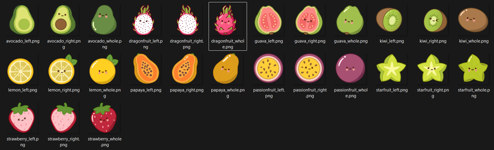

# 🍉 Fruit Slash

A fun arcade-style fruit slicing game built with **React** and **Python**.

Slice as many fruits as you can, avoid the cactus bombs, and beat your own high score! There is no final level or victory screen the challenge is simply to survive and improve with every round.

## 🎮 Gameplay

* 🍎 Slice flying fruits to earn points.
* 🌵 Avoid slicing the cactus bomb.
* ❤️ You have **3 lives**.
* 🏆 Try to beat your **highest score** every game.
* 🔊 Enjoy satisfying sound effects while playing.

## ✨ Features

* Responsive and interactive gameplay
* Original fruit and cactus illustrations created from scratch
* Fun sound effects for a more engaging experience
* High-score challenge with endless gameplay
* Clean and colorful user interface

## 🛠️ Built With

* **Frontend:** React
* **Backend:** Python
* HTML
* CSS
* JavaScript

## 🎨 Artwork

All fruit illustrations and the cactus bomb were illustrated by me specifically for this project.

## 📸 Screenshot

### Fruits

There is no finish line.

Every game is a new opportunity to improve your reflexes and set a new personal best.

Can you beat your highest score? 🍉🔥

---

Made with ❤️ using React, Python, and lots of fruit.
